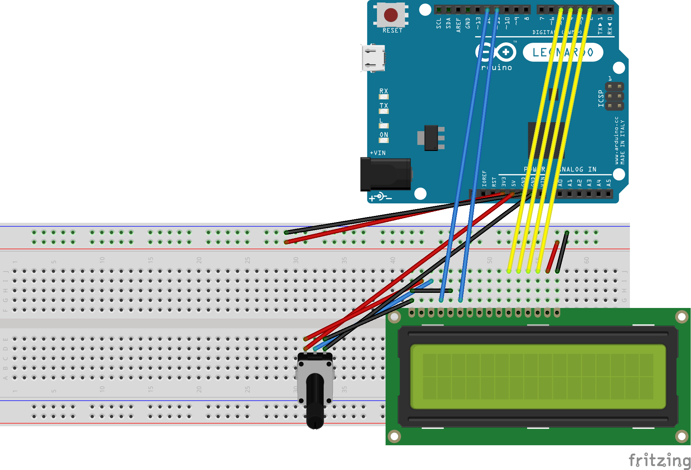

Example Chrome App built with Dart to send text to an Arduino board.

### Installation

**Chrome App:**

1. Go to `/path/to/this/repository/chrome_app`
2. Run `pub build`
3. In Chrome (or Chromium), go to "chrome://extensions"
4. Click "Load unpacked extension..." (_if not shown, activate the "Developer Mode"_)
5. Select `/path/to/this/repository/chrome_app/build/web/`

**Arduino Sketch:**

1. Run the [Arduino IDE](http://arduino.cc/en/main/software)
2. Open `/path/to/this/repository/arduino_sketch`
3. Upload to the board

### Circuit

### Screenshots

### License

MIT, see [LICENSE](LICENSE)

### Author(s)

[Claudio d'Angelis](http://claudiodangelis.com)

You?

